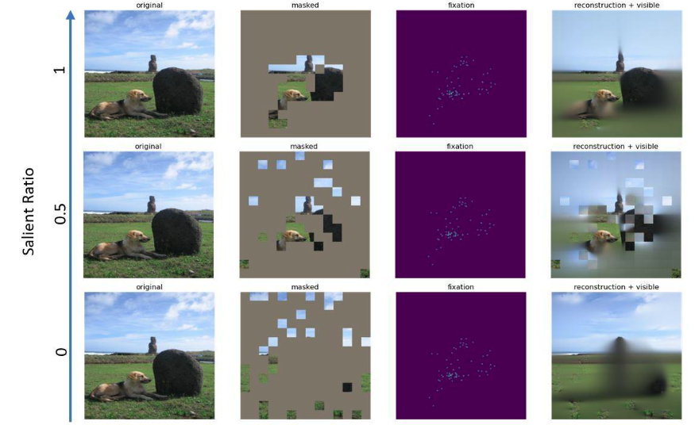
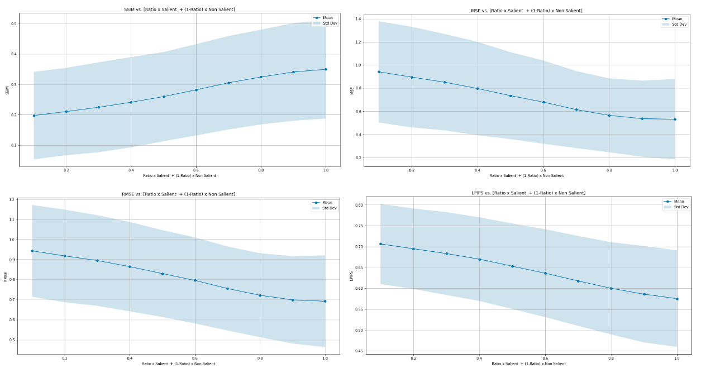

# Perceptual Evaluation of Masked AutoEncoder Emergent Properties Through Eye-Tracking-Based Policy

## Abstract
This project delves into enhancing image restoration techniques via self-supervised learning, specifically through the integration of Masked AutoEncoder (MAE) strategy with eye-tracking data. By merging fixation-based saliency with MAE, our goal is to better align computational image reconstruction methods with human visual perception. Our research highlights the potential of incorporating eye-tracking insights to improve both the accuracy and perceptual relevance of self-supervised learning models within the realm of computer vision, showcasing the convergence of computational image restoration and human perceptual systems.

## CCS Concepts
- Computing Methodologies
- Tracking
- Computing Methodologies
- Interest Point and Salient Region Detections

## Additional Keywords and Phrases
Self-supervised Learning, Image Reconstruction, Eye Movements, Visual Attention, Perceptual Quality Assessment

## Late Breaking Work

### Methodology
1. **Data Preparation:** We leverage an open-source comprehensive eye movement dataset, featuring 15 participants viewing 1003 images, to challenge the MAEs' reconstruction capabilities.
2. **Patch Selection Policy:** 
    - Salient Patch Identification: Utilizing eye-tracking data to identify high-interest patches.
    - Non-Salient Patch Selection: Selecting control patches outside the salient regions for comparative analysis.
3. **Model Configuration:** 
    - MAE Setup: Configuring a pre-trained masked autoencoder to evaluate the impact of patch selection on image quality.
    - Patch Processing: Preparing images by masking identified patches for MAE input.
4. **Reconstruction and Evaluation:** 
    - Reconstruction: Generating outputs for salient and non-salient patch selections.
    - Perceptual Quality: Assessing image quality using metrics like SSIM, MSE, RMSE, and LPIPS.
5. **Comparative Analysis:** Evaluating the impact of visual-attention-based patch selection on reconstruction quality and alignment with human perception.

**Qualitative Comparative Analysis**



**Quantitative Comparative Analysis**


## Getting Started

# Download the MIT1003 dataset
```bash
wget https://people.csail.mit.edu/tjudd/WherePeopleLook/ALLSTIMULI.zip-O 

wget https://people.csail.mit.edu/tjudd/WherePeopleLook/DATA.zip

wget https://people.csail.mit.edu/tjudd/WherePeopleLook/ALLFIXATIONMAPS.zip
```

# Unzip the dataset
```bash
unzip ALLSTIMULI.zip -d path/to/destination

unzip DATA.zip -d path/to/destination

unzip ALLFIXATIONMAPS.zip -d path/to/destination
```

Run the notebook, and change the paths based on your MIT1003 dataset location.

